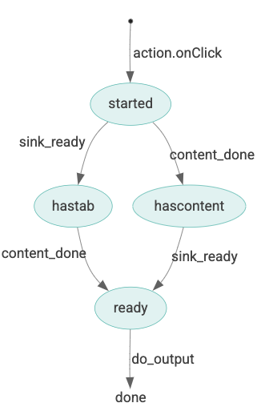

# MarkWack theory of operation

## Overall aim

Click -> Read and clean text from current page -> build Markov-chain dictionaries -> generate text -> output

## Communication model

## State model

The logical behavior of MarkWack is event driven, with the **background service worker** implementing a [finite state
machine](https://en.wikipedia.org/wiki/Finite-state_machine) that responds to events via listeners on:

* `action.onClick` &mdash; When the user clicks on the extension icon in the extension menu
* `runtime.onMessage` &mdash; Messages coming from the tab content scripts

The following state diagram and state transition table describe the state machine operation:

<table>
  <tr>
    <td>
      
    </td>
    <td>
      <table>
        <tr>
          <th>State</th><th>Event</th><th>New state</th>
        </tr>
        <tr>
          <td>(none)</td><td>action.onClick</td><td>started</td>
        </tr>
        <tr>
          <td>started</td><td>sink_ready</td><td>hastab</td>
        </tr>
        <tr>
          <td>started</td><td>content_done</td><td>hascontent</td>
        </tr>
        <tr>
          <td>hascontent</td><td>sink_ready</td><td>ready</td>
        </tr>
        <tr>
          <td>hastab</td><td>content_done</td><td>ready</td>
        </tr>
        <tr>
          <td>ready</td><td>do_output</td><td>(done)</td>
        </tr>
      </table>
    </td>
  </tr>
</table>
  

## Configurability

The options page (available through the extension menu icon's "more" widget) lets users select options for:

* Target paragraph and overall sizes
* Target sentence length
* Algorithmic details: sample chain length, generated sentence length, and (TODO: select between triplets/pairs for dictionary model)
* Output destination: an alert, a new tab, or (TODO: new window, other)
