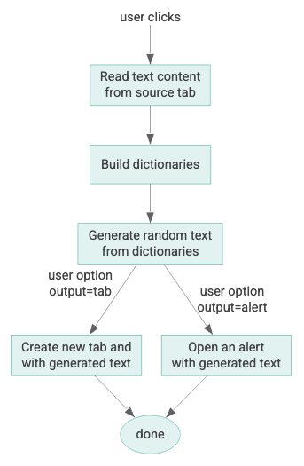
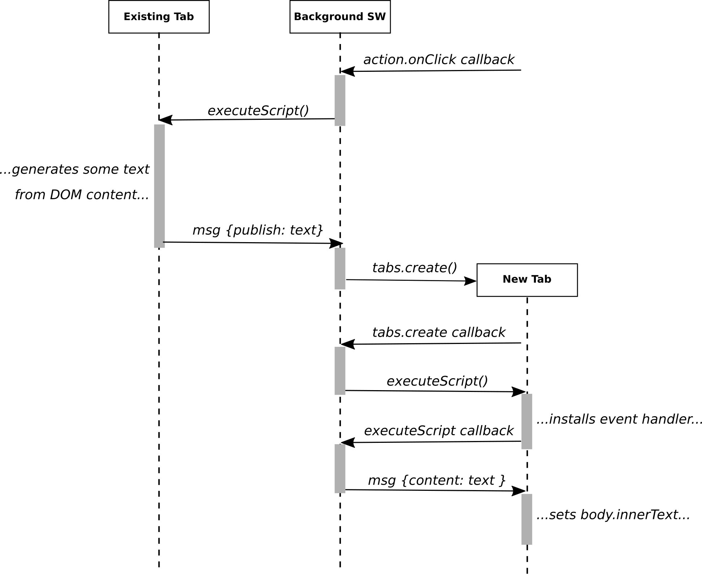

# MarkWack theory of operation

## The general idea

The extension generates some random text based on the text content of the current Chrome tab. Viewed procedurally, the process is described by the following flowchart:



A more functional view of this same processing might be:

```
output( choose_channel(), generatetext(build_dictionaries(sort_and_clean( get_page_content ))) )
```


## The saycontent.js content script, dictionaries, and Markov-chain algorithm

The construction of the random text from the page content is done in the file `saycontent.js`. The service worker injects this script into the source tab

*The term "source tab" refers to the tab that was active when the user clicked the extension's action icon. This is the tab whose content is used to generate the dictionaries and final output.*

### saycontent.js

This page is driven by an event handler that act on requests sent to the tab. The key request is "create", which generates
the random text from the page content.The general process of this is:

1. Read the text of the page.
2. Clean the text (removing certain problem characters and strings; it's a bit of a hack).
3. Split the text into an array of sentences, each containing an array of words.
4. Build the dictionaries (see below) based on the sentences.
5. Generate the text from the dictionaries and return the text.

### The dictionary object

Core to the random-text algorithm is the construction and use of a dictionary object. This contains a set of dictionaries (also known as associative arrays or hash tables) and plain arrays. The empty dictionaries object is defined as:
```
{
  firstWords[], // Words that can begin sentences
  lastWords[],  // Words that can end sentences
  wordPairs{},  // Dictionary of words that can follow each of many words
  wordTriples{} // Dictionary of words that can follow each of many 2-word chains
}
```
Both `wordPairs` and `wordTriples` are of the following form:

```
{ key1: [ word, word, word, ... ], key2: ... }
```
The keys in `wordPairs` are words, like "system"; the keys in `wordTriples` are concatenated tuples like "system|configuration".

### The Markov-chain algorithm

There is not much to the algorithm; most of the work is done by the data structures. Once the dictionary object is
constructed, the generation of a random sentence is essentially:

```
Pick a random first word and append it to the output.
Repeat until done:
  Using the previous word, pick the next word from either wordPairs{} or wordTriples{}
  Append the new word to the output
Add a period (".")
```

The more difficult part is the "until done". This means, once a minimum sentence length is reached,
start checking if the current word is in `lastWords[]` and, if so, it is done. BUT if the sentence
passes a maximum length, may need to forcibly output a last word and end.

## Communication model

Because the source tab, the background service worker,  the destination tab (when used), and the Chrome browser all run in separate processes, the implementation is highly asynchronous. This means that the communication between these processes must be handled in an orderly way. A conceptual overview of this process is shown in the following sequence diagram:



***Note that this diagram is inaccurate in several respects. Most importantly, it does not show the Chrome extensions platform
as a participant&mdash;the platform is what relays messages, provides the onClick event, and creates the output tab.***

## State model

The logical behavior of MarkWack is event driven, with the **background service worker** implementing a [finite state
machine](https://en.wikipedia.org/wiki/Finite-state_machine) that responds to events via listeners on:

* `chrome.action.onClick` &mdash; When the user clicks on the extension icon in the extension menu
* `chrome.runtime.onMessage` &mdash; Messages coming from the tab content scripts

The following state diagram and state transition table describe the state machine operation:

<table>
  <tr>
    <td>
      
    </td>
    <td>
      <table>
        <tr>
          <th>State</th><th>Event</th><th>New state</th>
        </tr>
        <tr>
          <td>(none)</td><td>action.onClick</td><td>started</td>
        </tr>
        <tr>
          <td>started</td><td>sink_ready</td><td>hastab</td>
        </tr>
        <tr>
          <td>started</td><td>content_done</td><td>hascontent</td>
        </tr>
        <tr>
          <td>hascontent</td><td>sink_ready</td><td>ready</td>
        </tr>
        <tr>
          <td>hastab</td><td>content_done</td><td>ready</td>
        </tr>
        <tr>
          <td>ready</td><td>do_output</td><td>(done)</td>
        </tr>
      </table>
    </td>
  </tr>
</table>
  


## Configurability

The options page (available through the extension menu icon's "more" widget) lets users select options for:

* Target paragraph and overall sizes
* Target sentence length
* Algorithmic details: sample chain length, generated sentence length, and (TODO: select between triplets/pairs for dictionary model)
* Output destination: an alert, a new tab, or (TODO: new window, other)
